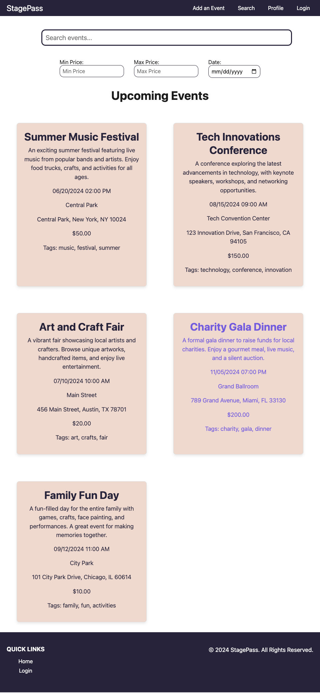
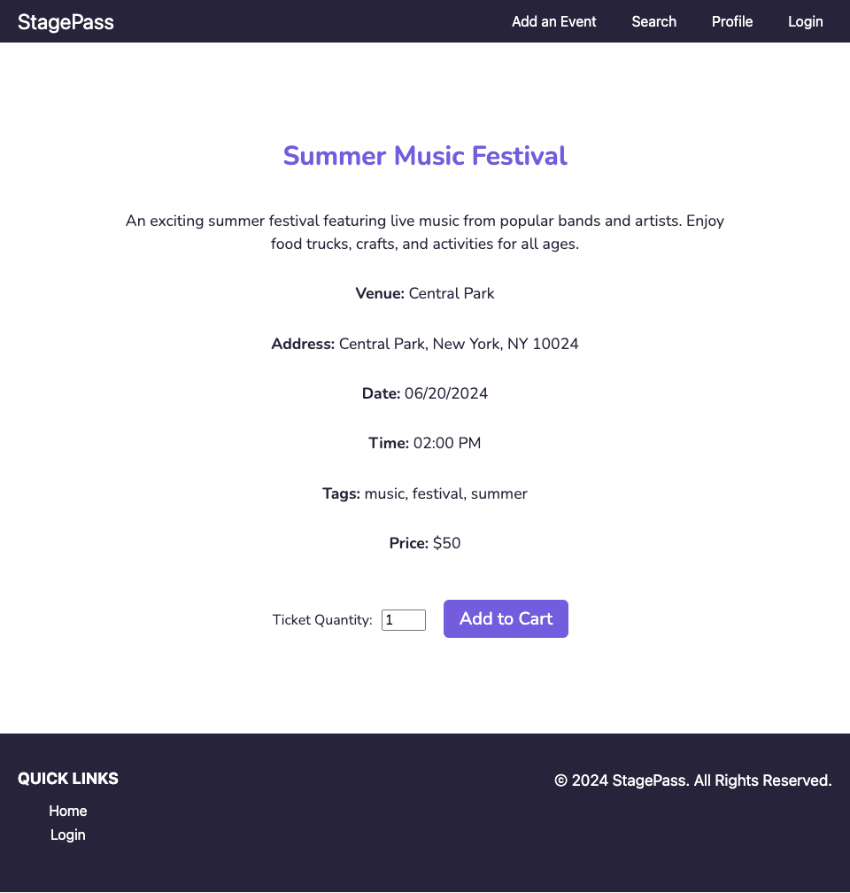
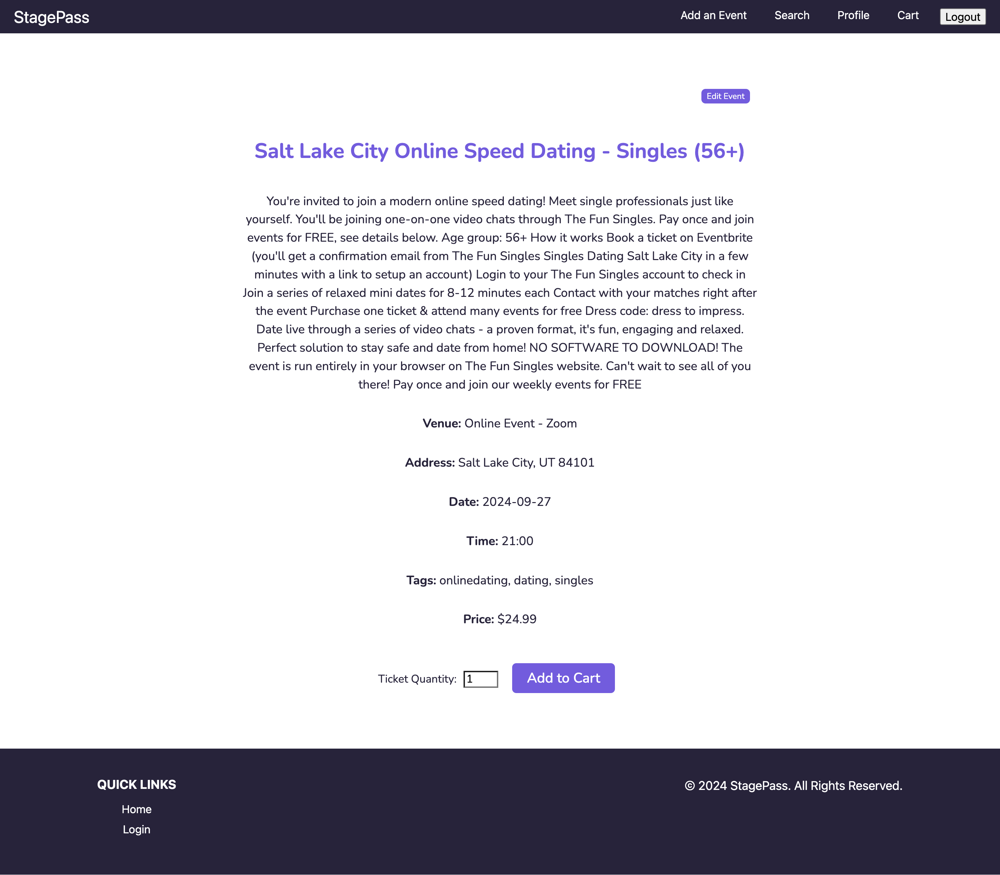
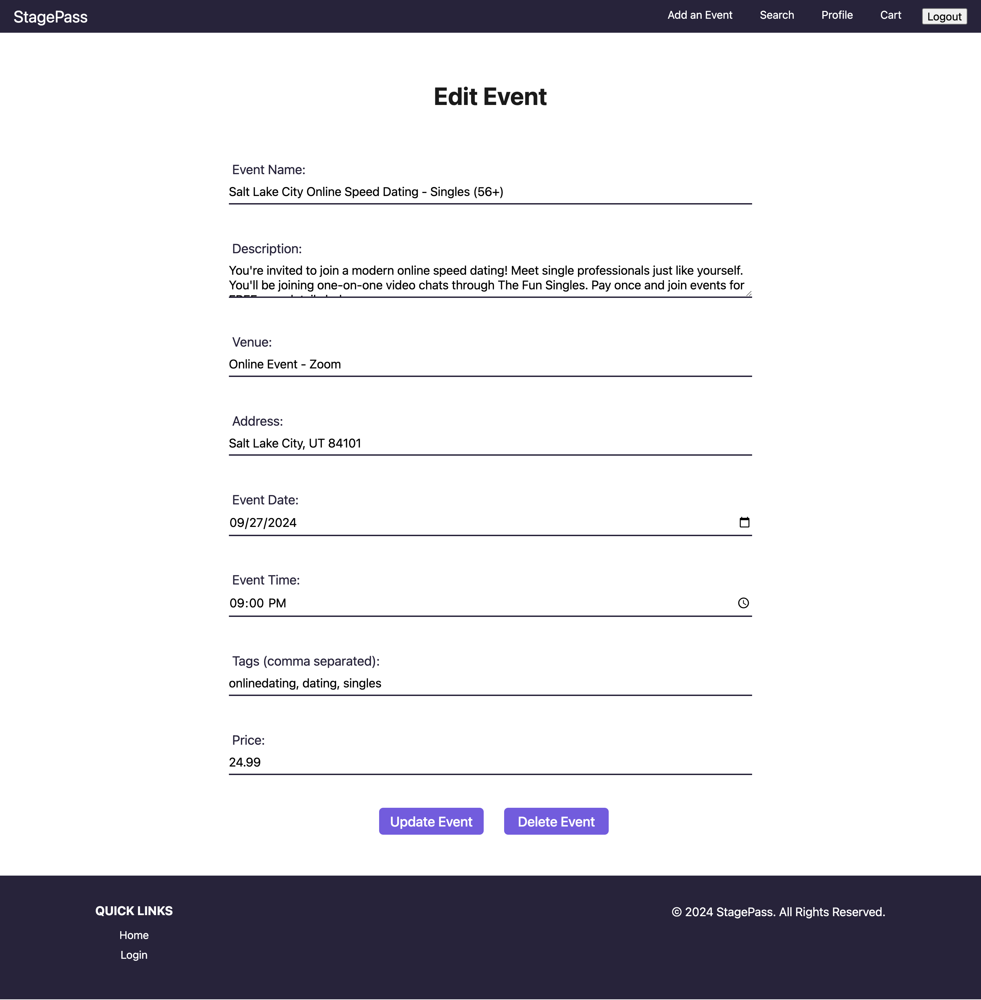

# event-ticketing-app
Event ticketing application

Live application:
Repo: https://github.com/danielleboe/event-ticketing-app

# Product Name
StagePass event ticketing platform

[![NPM Version][npm-image]][npm-url]
[![Build Status][travis-image]][travis-url]
[![Downloads Stats][npm-downloads]][npm-url]

## Description
The user can easily view, create, edit and delete events on the event ticketing app. They can also add to cart and checkout tickets. 

# Demo Video and Screenshots
<video controls src="client/src/assets/StagePass-Demo.mp4" title="Title"></video>

## Screenshots
### Homepage


### Event Page



### Event Page Form


## Installation
```sh
npm install
```

```sh
npm run build
```

```sh
npm run develop (develop environment)
```
```sh
npm run start (production environment)
```

## Release History

* 0.1
    * Initial Deploy

# License
MIT License

[https://github.com/danielleboe/event-ticketing-app](https://github.com/danielleboe/event-ticketing-app)


## Contributors
- Danielle Boenisch danielleboenisch@gmail.com https://github.com/danielleboe
- Chris Williams
- Joey Sandoval
- Kyle Sunday